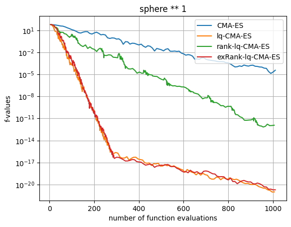
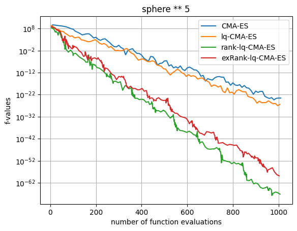

# rank-lq-cma-es
An invariant surrogate assisted CMA-ES under strictly increasing transformations of the objective function, using a linear quadratic model as surrogate on rank values instead of fitness values. [(see paper)](https://doi.org/10.1145/3712255.3726606)

## Content of the repository

1. Implementation of the module `rank-lq-cma-es`
2. The performance data of `rank-lq-cma-es` and an extended instance of the `rank-lq-cma-es` using as transformation the original fitness values can be found [here](https://mgharafi.github.io/rank-lq-cma-es/).

## Usage

Install the module via the following command:
```bash
pip install git+https://github.com/mgharafi/rank-lq-cma-es
```

Import the necessary modules:

```python
import cma
from ranklqcma import RankLQModel
import numpy as np
```

Define the problem and the surrogate models as follows:
For all cases use the following wrapper around the problem to count proper evaluations:

```python
# wrapper around the problem to count proper evaluations
fun = cma.fitness_transformations.Function(fitness)
```

To use the original `CMA-ES`:
```python
# CMA-ES
surrogate = fun
```

To use `lq-CMA-ES`, keep the model as `None` or just do not assign a model:
```python
# lq-CMA-ES
model = None
surrogate = cma.fitness_models.SurrogatePopulation(
    fun,
    model=model
)
```

To use the `rank-lq-CMA-ES`, keep the model as `None` or just do not assign a model and assign the transformation of function values into ranks as follows:
```python
# rank-lq-CMA-ES
model = None
surrogate = cma.fitness_models.SurrogatePopulation(
    fun,
    model=model
)
surrogate.model.settings.f_transformation = lambda x: np.asarray(cma.utilities.utils.ranks(x), dtype=float)
```

In order to use the `extended rank-lq-CMA-ES`, Instantiate the model with `RankLQModel(use_cma_transformation=False)` and make sure to set the `surrogate.weighted` to `True` or `False`as follows:

```python
# extended rank-lq-CMA-ES
model = RankLQModel(use_cma_transformation=False)
surrogate = cma.fitness_models.SurrogatePopulation(
    fun,
    model=model
)
surrogate.weighted = True
```

After instantiating the surrogate, initialize the CMA-ES, by defining the dimension, the initial conditions, and other `CMA-ES` parameters as follows:

```python
dimension = 10
x0 = np.random.uniform(-5, 5, dimension)
sigma0 = .2
budget = 1000

es = cma.CMAEvolutionStrategy(
    x0,
    sigma0,
    {
        #"seed": 840296, # Uncomment to fix the seed for different runs
        "popsize_factor": 1,
        "tolfun": 0e-12,
        "tolfunhist": 0e-12,
        # 'tolflatfitness': 1000,
        "ftarget": -np.inf,
        "maxfevals": budget,
    },
)
```
Finally run the algorithm, by starting the ask-n-tell loop as follows:
```python
while not es.stop():

    solutions = es.ask()
    fvals = surrogate(solutions)
    es.tell(solutions, fvals)

    # ----------------------------- bookkeeping ----------------------------- #
    es.countevals = fun.evaluations  # record only "true" evaluations
    es.disp()  # just checking what's going on
    es.logger.add()  # add the current state to the log
```

## Example of runs

In the plots below we see a comparaison of runs of `cma-es`, `lq-cma-es`, `rank-lq-cma-es` and `extended rank-lq-cma-es` on the sphere function raised to the power 1 and 5.




## Acknowledgements

This module is based on the implementation of [CMA-ES](https://github.com/CMA-ES/lq-cma) by Nikolaus Hansen. It is part of research conducted with the support of the consortium in Applied Mathematics CIROQUO, gathering partners in industry and academia, in particular Storengy, for the development of advanced methods for Computer Experiments.